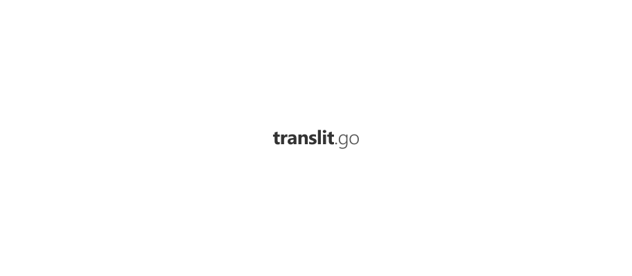

  
  
  
  
   
  
  
  
  

<a href="#ci-status">CI Status</a> • <a href="#license">License</a>

 

`translit` is a Go package for Russian text transliteration.

Supported output formats:

* Scientific
* ISO 9:1995/A ГОСТ 7.79-2000/A
* ISO 9:1995/B ГОСТ 7.79-2000/Б
* BGN/PCGN
* ALA-LC
* BS 2979:1958
* ICAO

### CI Status

| Branch | Status |
|------------|--------|
| `master` |  |
| `develop` |  |

### License

[Apache License, Version 2.0](https://www.apache.org/licenses/LICENSE-2.0)

